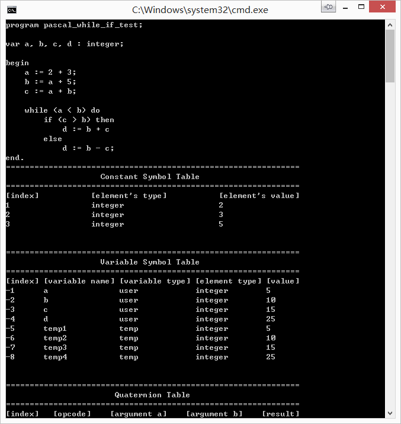
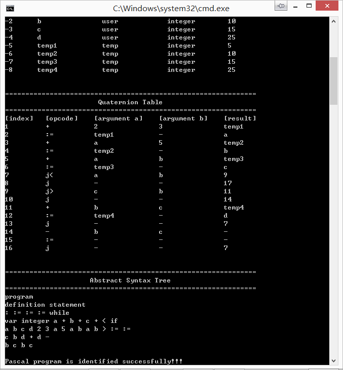

# pascal_simple_compiler

## Description
This is the experimental project of compile principle. It implements lexical and syntax analysis, generate intermediate codes for optimization and generating assembly in the future.

## Screenshots

